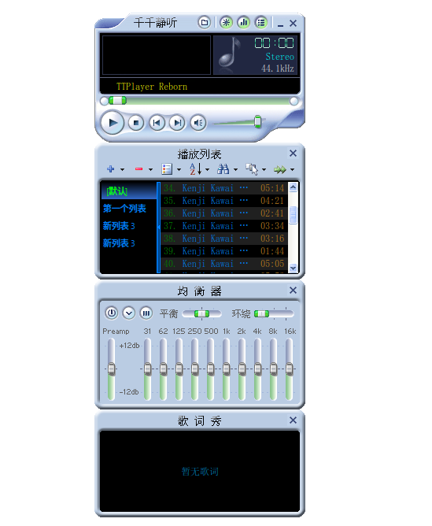
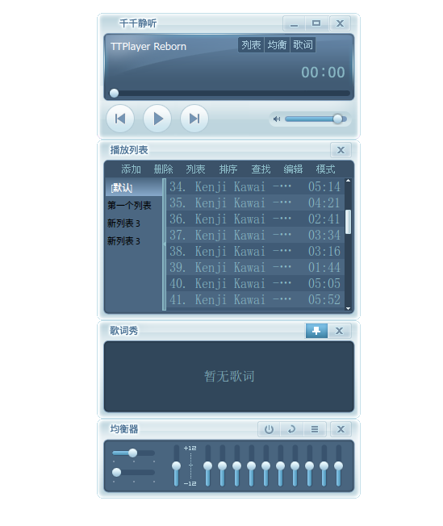
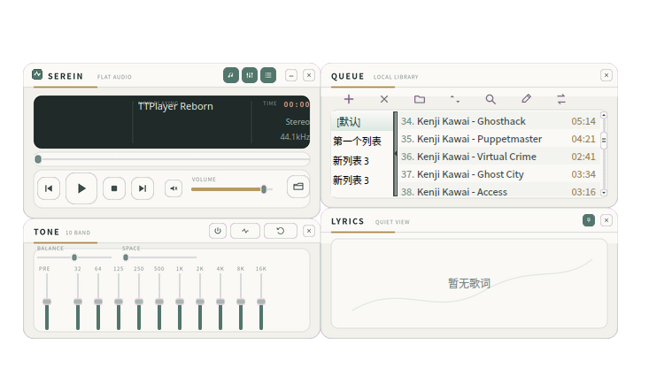
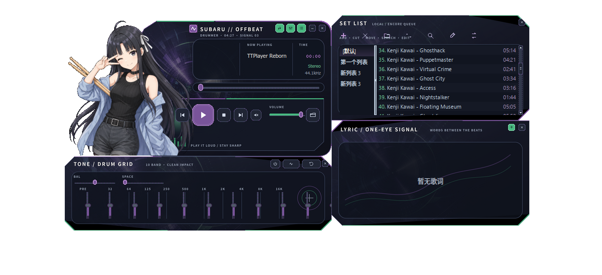

# TTPlayer Reborn（千千静听复刻版）

一个基于 Qt6 / C++ 的千千静听（TTPlayer）**个人研究项目**，支持原版皮肤格式，还原经典播放器界面与交互。同时正在进行 Lazarus/FPC 重写，以实现更好的跨平台支持。

> ⚠️ 本项目仍处于早期阶段，存在较多 bug 与未实现功能，仅供交流学习。

---

## 皮肤预览

| | |
|---|---|
|  |  |
| **Classic** 经典皮肤，本程序默认皮肤 | **Skin1** 千千静听 5.x 某版本默认皮肤 |
|  |  |
| **Serein Flat** Codex 辅助生成 | **Subaru Offbeat** Codex 辅助生成 |

> Serein Flat 与 Subaru Offbeat 为 Codex 辅助生成的皮肤，可自行优化修改。

---

## 功能

- 🎵 音频播放（FFmpeg 解码 + SDL2 输出）
- 🎨 原版千千静听皮肤格式（`.skn`）解析与渲染，兼容上百套皮肤
- 📋 播放列表，兼容原版 TTBL 格式
- 📝 歌词显示（LRC）
- 🎚 均衡器与 DSP 链
- 🪟 多窗口界面：主播放器、播放列表、歌词、均衡器，支持窗口吸附与联动

---

## 目录结构

```
TTPlayer-Reborn/
├── CMakeLists.txt            # Qt/C++ 构建配置
├── Skin/                     # 内置皮肤（.skn + .skn.xml 侧车布局）
│
├── src/                      # Qt C++ 源代码（当前可运行版本）
│   ├── app/                  # Application 顶层管理、Config
│   ├── audio/                # AudioEngine、Decoder、DspChain、Equalizer、AudioOutput
│   ├── skin/                 # SkinEngine、SkinParser、SkinButton（皮肤引擎）
│   ├── ui/                   # PlayerWindow、PlaylistWindow、LyricWindow、EqualizerWindow
│   │                         #   VisualWidget（频谱动画）、WindowSnapManager（窗口吸附）
│   ├── lyric/                # LrcParser
│   ├── playlist/             # PlaylistManager、TtblParser/Writer、MetadataLoader
│   └── tools/                # 测试辅助工具
│       ├── SkinDumper         # --dump-skin：皮肤解析结果序列化为 JSON
│       └── FrameDumper        # --dump-frames：窗口渲染快照（golden 生成）
│
├── pascal/                   # Lazarus/FPC 重写（进行中，见 docs/lazarus-rewrite.md）
│   ├── src/
│   │   ├── skin/             # USkinTypes、USkinXmlParser、USkinLoader、USkinJsonDump
│   │   ├── render/           # USkinRender（渲染原语，Qt source-over 精确复刻）
│   │   ├── backend/          # UPlayerBackend（IPlayerBackend 接口 + TStubBackend 桩）
│   │   ├── playlist/         # UPlaylistModel
│   │   └── ui/               # Player/Playlist/EQ/Lyric + WindowSnap
│   ├── tests/                # FPCUnit 测试（Layer 2/3/4 + Playlist + WindowSnap）
│   │   ├── UTestLayer2.pas   # 渲染快照测试
│   │   ├── UTestLayer3.pas   # 解析逻辑 expect 测试
│   │   ├── UTestMetamorphic.pas  # Metamorphic 测试
│   │   ├── UTestPlaylistModel.pas
│   │   └── UTestWindowSnap.pas   # 窗口吸附 + MR-4
│   ├── vendor/bgrabitmap/    # BGRABitmap v11.6.6（git submodule）
│   ├── ttdump.lpi/.lpr       # Pascal 侧皮肤 JSON dump 工具
│   └── tests.lpi/.lpr        # FPCUnit 测试可执行文件
│
├── tests/
│   ├── golden/
│   │   ├── skinjson/         # Layer 1 基准：Qt 皮肤解析 JSON（11 套皮肤）
│   │   ├── frames/           # Layer 2 基准：Qt 渲染 PNG（各窗口各状态）
│   │   └── masks/            # 像素比对时排除的文本/动画区域掩码
│   └── artifacts/            # 测试失败时的三联对比图（本地产物，不入库）
│
├── tools/                    # 构建与测试脚本（PowerShell，Windows 侧运行）
│   ├── test-all.ps1          # ★ 统一测试入口（Layer 1-4 全部测试）
│   ├── test-layer1.ps1       # Layer 1 差分测试
│   ├── gen-golden.ps1        # 从 Qt 版生成 golden 基准数据
│   ├── build-pascal.ps1      # lazbuild 构建全部 Lazarus 工程（Windows）
│   ├── build-pascal-linux.sh # 用户目录 FPC + Lazarus GTK3 构建
│   └── test-gtk3-wayland.sh  # Linux FPCUnit + XWayland/X11 --probe
│
└── docs/
    ├── testing.md                   # 测试体系详细文档
    ├── lazarus-rewrite.md           # Lazarus 重写计划与进展
    └── debugging-and-profiling.md   # 符号、WinDbg、ETW、DTrace、perf
```

---

## 皮肤使用

皮肤文件为 `.skn` 格式（ZIP 包，内含 BMP 位图 + XML 配置），可直接使用原版千千静听皮肤：

1. 将 `.skn` 文件（及同名 `.skn.xml` 侧车布局，可选）放入程序运行目录下的 `Skin/` 文件夹。
2. 启动程序后在托盘右键菜单中切换皮肤。

`Skin/` 目录已内置多套皮肤，可直接使用。

---

## 构建（Qt 版）

**依赖**

| 依赖 | 用途 |
|---|---|
| Qt6 Widgets | GUI |
| FFmpeg（avformat/avcodec/avutil/swresample） | 音频解码、重采样、标签读写。Linux 用发行版共享库；Windows 用 `third_party/ffmpeg`（shallow submodule，pin n8.1.2）编音频-only 静态库打进 `ttcore.dll` |
| SDL2 | 音频输出（Windows 运行时旁放 `SDL2.dll`） |
| QuaZip-Qt6 | 皮肤文件（ZIP）解压 |
| Qt6 DBus（可选，Linux） | MPRIS 媒体控制 |
| X11（可选，Linux） | 全局快捷键 |

已在 **Windows（MSYS2/MinGW64）** 和 **Kubuntu（Linux）** 编译成功。

构建配置三种（CMake `CMAKE_BUILD_TYPE` / Lazarus `--bm` 同名）：

| 配置 | 含义 |
|---|---|
| **Debug** | 低优化 + 调试信息（Windows 另用 cv2pdb 把 DWARF 转成 PDB） |
| **Release** | 优化、无调试信息 |
| **Profile** | 与 Release 相同的优化，加上调试信息与帧指针，给采样 profiler 用。Windows 同样走 cv2pdb |

另有 Lazarus **HeapTrc**（`-gh`），只用于堆诊断，不是第四种发布配置。HeapTrc / PageHeap、WinDbg、ETW、DTrace 见 [docs/debugging-and-profiling.md](docs/debugging-and-profiling.md)。

**Linux / macOS**

FFmpeg / SDL2 走发行版包管理（pkg-config），不要自备 kitchen-sink 前缀：

```bash
sudo apt install cmake g++ pkg-config \
  libavformat-dev libavcodec-dev libavutil-dev libswresample-dev libsdl2-dev
# Qt 版另需 Qt6 Widgets 等
cmake --preset debug     # 或 release / profile；Qt 版仍可 cmake -B build ...
cmake --build --preset debug
# ttcore 快捷脚本（默认 Debug）：
bash tools/build-ttcore-linux.sh
bash tools/build-ttcore-linux.sh --config Profile
```

**Windows（MSYS2/MinGW64 工具链，PowerShell）**

编译器仍用 MSYS2 gcc。FFmpeg 不走 pacman 共享包：先编音频-only 静态库，再编程序。

**运行时自包含**：只要 `ttcore.dll`（FFmpeg + MinGW CRT 已静态打进 DLL）和旁边的 `SDL2.dll`。不依赖 MSYS2、不依赖 MinGW CRT DLL、也不读 `C:\Programs` 这类硬编码路径。构建机用 `SDL2_PREFIX` 或 mingw64 的 `pkg-config sdl2` 找到 SDK，CMake 把 `SDL2.dll` 复制到输出目录。

Debug / Profile 会下载 `cv2pdb`（rainers/cv2pdb 0.54）并把 PDB 放到 `pascal\bin\`（WinDbg / WPA 用）。需要本机 Visual Studio 的 `mspdb140.dll`。调试、采样与已知限制见 [docs/debugging-and-profiling.md](docs/debugging-and-profiling.md)。

```powershell
git submodule update --init --depth 1 third_party/ffmpeg
pwsh tools/build-ffmpeg-win.ps1
pwsh tools/build-ttcore-win.ps1                 # 默认 Debug
pwsh tools/build-ttcore-win.ps1 -Config Profile
pwsh tools/build-ttcore-win.ps1 -Config Release
# 可选：官方 MinGW SDL2 根目录（含 include/SDL2 与 bin/SDL2.dll）
# $env:SDL2_PREFIX = 'D:\sdl2\x86_64-w64-mingw32'
```

---

## 构建（Lazarus 重写版）

> 详见 [docs/lazarus-rewrite.md](docs/lazarus-rewrite.md)

**Windows**

```powershell
# BGRABitmap + FFmpeg（FFmpeg 在 .gitmodules 里 shallow=true，depth 1）
git submodule update --init --depth 1

# 音频-only 静态 FFmpeg + ttcore.dll（旁放 SDL2.dll）
pwsh tools/build-ffmpeg-win.ps1
pwsh tools/build-ttcore-win.ps1

# 构建全部 Pascal 工程（ttdump + tests + skinpreview + ttplayer，默认 Debug）
pwsh tools/build-pascal.ps1
pwsh tools/build-pascal.ps1 -Config Profile
```

**Linux（GTK3 + XWayland，用户目录 FPC/Lazarus）**

```bash
sudo apt install cmake g++ pkg-config \
  libavformat-dev libavcodec-dev libavutil-dev libswresample-dev libsdl2-dev
bash tools/build-ttcore-linux.sh
bash tools/build-pascal-linux.sh
bash tools/build-pascal-linux.sh --config Debug
bash tools/test-gtk3-wayland.sh
```

---

## 测试

> 详见 [docs/testing.md](docs/testing.md)

```powershell
# 运行全部测试（Layer 1 差分 + Layer 2/3/4 FPCUnit）
pwsh tools/test-all.ps1

# 仅 Layer 1（Qt vs Pascal 解析差分）
pwsh tools/test-layer1.ps1

# 重新生成 golden 基准（Qt 版需已编译）
pwsh tools/gen-golden.ps1 -SkipBuild
```

**当前测试状态：Layer 1 11/11；Windows / Linux FPCUnit 90/90**

| 层级 | 方法 | 覆盖内容 |
|---|---|---|
| Layer 1 | Differential | 11 套皮肤解析 JSON 与 Qt 版差分为零 |
| Layer 2 | Snapshot | 11 套皮肤 player/EQ/lyric/playlist 帧像素一致（容差 ±1，文本走 mask） |
| Layer 3 | Expect | LOGFONT/position/color/bool + LRC + TTBL |
| Layer 4 | Metamorphic | 滑块数学性质 + 色键变形 + 位置解析独立性 |
| Layer 5 | GUI 冒烟 | 四窗口渲染、换肤、EQ 开关、窗口吸附 |

---

## 已知问题 / 限制

- Qt 版仍有较多 bug，功能不完善。
- Lazarus 重写版（`pascal/`）四个皮肤窗口 + Windows 吸附已可运行；音频仍为 `TStubBackend`（ttcore 抽库未开始）。
- Lazarus Linux 只支持 X11（XWayland / Xorg，`GDK_BACKEND=x11`），不支持 Wayland 客户端。GTK3 皮肤窗：无 CSD、XShape、标题栏拖动、吸附、置顶（对齐 Windows）。
- LCL GTK3 的 `Handle` 是 `TGtk3Widget` 对象，不是 `GtkWidget*`；已在 `UPlatformWindow` 中转换，避免 `gtk_widget_get_window` Access violation。

---

## 说明

本项目为个人学习与怀旧用途的复刻，未包含原版千千静听程序本体，版权归相关方所有。`Skin/` 内皮肤包含自带皮肤和 AI 辅助生成的皮肤，经过上百套皮肤兼容性测试。
